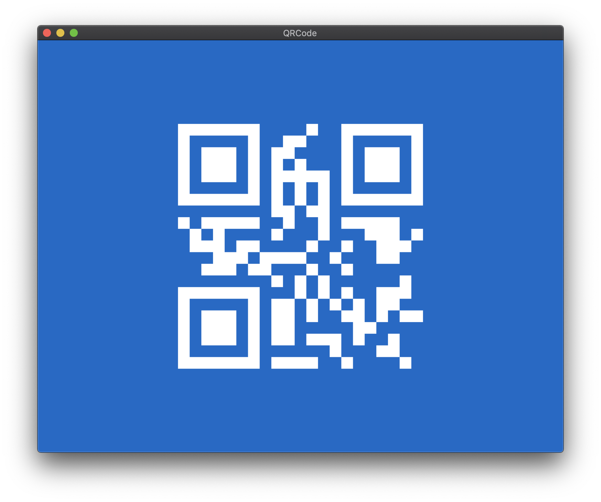

# QRCode

App to generate test QR Codes.

## Customizing the QR Code

### In app

Press ⌘ + K, type the code then press Return.

### From terminal

Run the app from terminal, like so:

```bash
/Applications/QRCode.app/Contents/MacOS/QRCode -QRCode "Testing 1,2,3"
```

